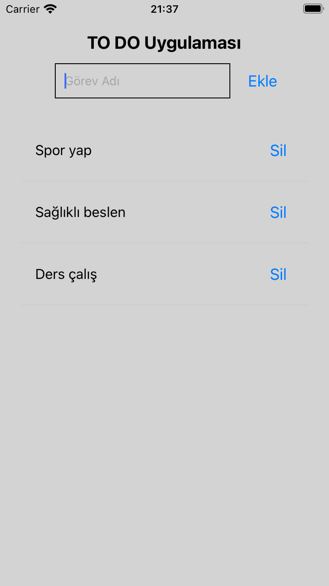
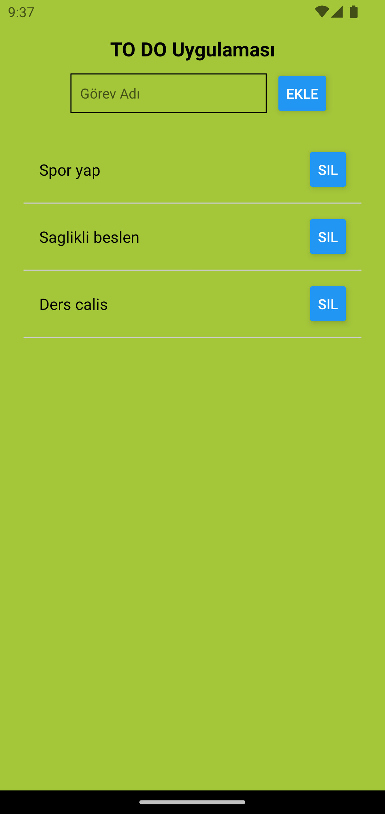

# Kocaeli University React Native Example Project

This is an example project for Kocaeli University using React Native.

<div style="display: flex; justify-content: space-around;">
    
    
</div>

## Prerequisites

- Node.js
- npm or yarn
- Expo CLI

## Getting Started

### Step 1: Clone the Project

```sh
git clone https://github.com/alierensevinc/Kocaeli-University-RN-Example.git
cd Kocaeli-University-RN-Example
npm install
```

### Step 2: Run the Project

#### For iOS

```sh
npm run ios
```

#### For Android

```sh
npm run android
```

### Folder Structure

```
Kocaeli-University-RN-Example/
├── assets/                 # Assets such as images and fonts
│   └── screenshots/        # Screenshots for README
│       ├── android.png
│       └── ios.png
├── src/                    # Source files
│   ├── components/         # Reusable components
│   │   └── ListItem.jsx    # List item component
│   └── App.js              # Main application file
├── .gitignore              # Git ignore file
├── app.json                # Expo configuration
├── babel.config.js         # Babel configuration
├── package.json            # Project dependencies and scripts
├── README.md               # Project documentation
└── yarn.lock               # Yarn lock file
```

### Useful Links

[React Native Docs](https://reactnative.dev/docs/getting-started)

[Expo Docs](https://docs.expo.dev/)
